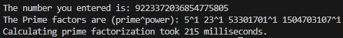

# Prime Factorization

## Introduction 

This is a project to create a program to generate the prime factorizations of any given number. I intended this as a project to understand C++. As of now(2/10/2025) I do not know specifically what applications this may have but I just thought it'd be cool to work through as a hobby.

## Current Capabilities
* Handles numbers up to `unsigned long long` max which is 18,446,744,073,709,551,615.
* Measures computation time to calculate prime factorizations.

## Current Issues
* `long long` has a limit at quintillion.
* No input sanitization (take `long long` input but no catches for strings).
* Brute force check for prime numbers.(Work in Progress)
* `while` loops can result in long calculation times.
* No GUI capabilities.
* Code is O(N) efficient.
* Issues with usability[^1]

## How to Use
Simply compile the code and create an executable object. Then run the executable object in your terminal. 

## Test Results
- Note: all tests are done with `LLONG MAX'[^2]
- Test result of initial working version(0.01)

## Foot Notes
[^1]: The goal of usability to is make this program as easily used by anyone. Thus the use of a terminal is not optimal. As a result, creating an executable that is downloable is prefereable.

[^2]: `ULLONG MAX' is 18446744073709551615
